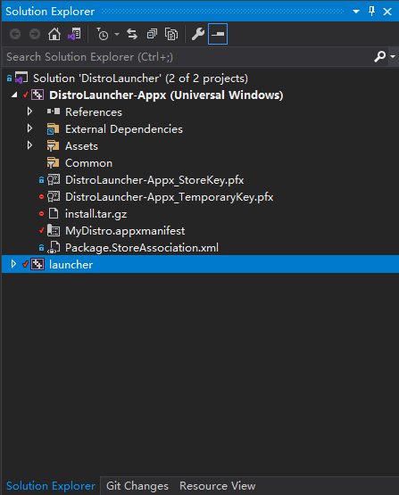
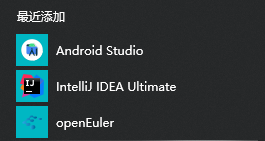
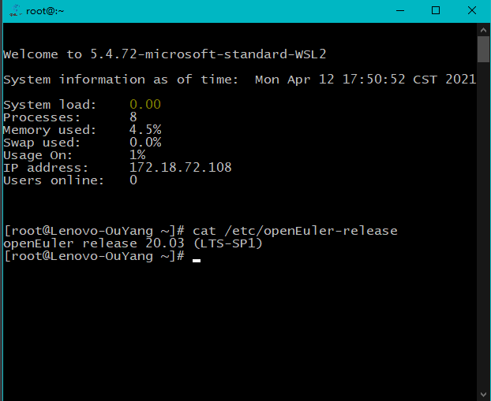
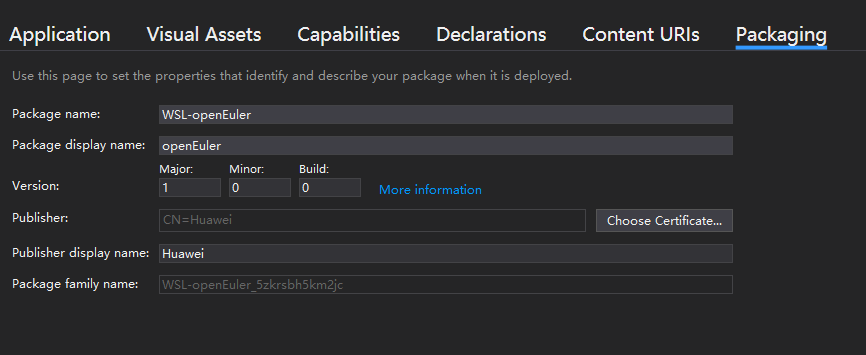

# How to run openEuler under WSL

1. use the launcher.exe I have built already.
2. manually import openEuler into  WSL

## use the launcher.exe

Since the UWP has not been uploaded to the Microsoft Store, we can only be open this package locally for the time being. There are two ways:

1. double click to run  x64\Debug\launcher.exe, to install openEuler
2. Or build the installation package by following these steps. Please note that I have not tested it on other computers and am not sure wether the signature I generated will cause an error or not.

### Build the luncher  package using the project

Use Visual Studio to open WSL-DistroLauncher\DistroLauncher.sln

In Solution Explorer, usually on the right, you can see the following screen



Right click "Solution (DistroLauncher)"，Click "Deploy Solution" in the pop-up menu 

After the compilation is complete, you can start OpenEuler in the Windows Start Menu in the lower left corner



Click to run openEuler

Or run from the command line:

```
wsl -d openEuler
```



## Manually import openEuler

reference doc: https://docs.microsoft.com/en-us/windows/wsl/use-custom-distro

Download the Docker image of OpenEuler LTS patch image: https://repo.openeuler.org/openEuler-20.03-LTS-SP1/docker_img/x86_64/openEuler-docker.x86_64.tar.xz


**Start Ubuntu under WSL** **in the folder where the downloaded image is located.** At this point, the Ubuntu working directory is the current directory

```
wsl -d Ubuntu
```


Install docker under Ubuntu

```
curl -fsSL https://get.docker.com | bash -s docker --mirror Aliyun
```


Import the image. -i indicates that the tar package is used to import the image

```shell
docker load -i .\openEuler-docker.x86_64.tar.xz
```


List current images

```
docker images
```


You should have the following line:

```
REPOSITORY                 TAG       IMAGE ID       CREATED         SIZE
openeuler-20.03-lts-sp1    latest    6934cec25f28   3 months ago    512MB
```


Run any command to load the container

```sh
docker run openeuler-20.03-lts-sp1 echo hello, openEuler WSL
```


Export a snapshot of the Docker container, the current file system.

Docker PS-QL means to get the container number of the most recently run container, which is just the container number of OpenEuler

```shell
docker export $(docker ps -ql) > ./openEuler.tar
```


Quit Ubuntu, start WSL, import the OpenEuler package and set D:\work\WSL\ OpenEuler as the WSL installation directory

```
wsl --import openEuler D:\work\WSL\openEuler .\openEuler.tar
```


Run openEuler!

```
wsl -d openEuler
```


## The process of building a launcher .exe

1. Clone the official launcher's repository, modify the launcher basic information: use Visual Studio, change the package name, publish the company, modify the image logo, etc.
2. Install WSL、Ubuntu
3. Export Docker: Under Ubuntu, use the LOAD command to load the Docker image, and use EXPORT to export the current file system snapshot of the container, compressed as install.tar.gz
4. Build package: Put install.tar.gz in the root directory of the project
5. Using VS, deploy the project solution
6. The OpenEuler icon appears in the Windows Start Menu and can be clicked to run OpenEuler-WSL

## detailed procedure

### Clone, modify the basic information

```shell
git clone https://github.com/Microsoft/WSL-DistroLauncher
```


First, install Visual Studio. VS Code doesn't seem to have the features you'll need below

Open the project file in Visual Studio

Double-click to open MyDistro. AppXManifest, and VS will automatically probe the XML format and display a nice screen like this.



If VS display a pure XML file, you need to configure the relevant environment, here I google for a long time, I am sorry for forgetting the specific solution , it seems like installing C++ desktop development SDK in VS.


From the interface, click on the Packaging TAB, click Choose Certificate... , click the Create... Publish Name, I typed HUAWEI, I wanted to use HUAWEI Technologies Co., Ltd, but it got an error, so I just used HUAWEI. Then enter the password to create the certificate.


Modify the basic information under the Application TAB and modify the Visual Asserts image information.

You can use the Asserts Generator to generate images of different sizes and formats based on a single logo image.

The logo on the official website is too small, so I found the vector picture of the logo and AI file in the department, enlarged it, and took Ubuntu startup icon as reference, cut out the text part, and only retained the logo, so as to make the generated logo look better in the startup interface. All the resulting images can be seen in my project files.

### Install WSL、Ubuntu

To install WSL, refer to the official documentation: https://docs.microsoft.com/en-us/windows/wsl/install-win10

Then installs Ubuntu in Microsoft Store and automatically creates root user after running. Enter the user name and password

### Export docker

[Refer to the manual import section](# 手动导入openEuler)

The last step is to change to

```
docker export $(docker ps -ql) > ./install.tar
```

Quit Ubuntu and compress the package

```
exit
gzip.exe -k .\install.tar
```

-k means to keep the package, not delete it

### Build 

Copy install.tar.gz to the root of your project

Right-click "Solution (DistroLauncher)" in the VS Solution directory and click Deploy Solution

Wait for the build to complete

