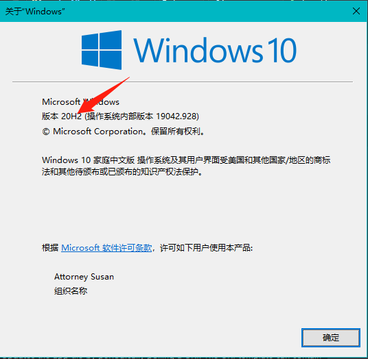
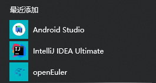
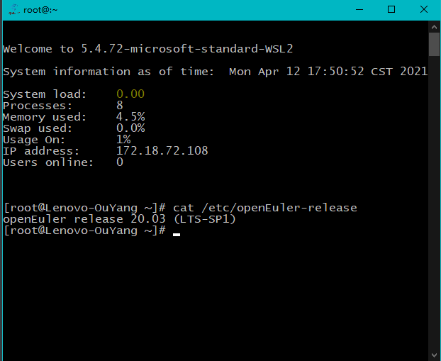
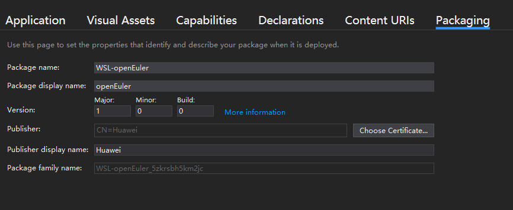

[toc]

*Read this in other languages:* [English](./README.md), [简体中文](./README.zh-cn.md)

# How to run openEuler under WSL

1. Configuring the Windows environment.
2. Use the distro.exe I have built already.
3. Or manually import openEuler into WSL.

## Configuring the Windows environment

You can reference the [Official doc](https://docs.microsoft.com/en-us/windows/wsl/install-win10)，or follow the following instructions.

Open PoweShell, you can press Win+Q to search PoweShell.

Copy and paste those  commands.

1. Enable the Windows Subsystem for Linux.

```powershell
dism.exe /online /enable-feature /featurename:Microsoft-Windows-Subsystem-Linux /all /norestart
```

2. Enable Virtual Machine feature.

```shell
dism.exe /online /enable-feature /featurename:VirtualMachinePlatform /all /norestart
```

3. Download [the Linux kernel update package](https://wslstorestorage.blob.core.windows.net/wslblob/wsl_update_x64.msi)，Double-click to run, administrator privileges may be required.
4. Set WSL 2 as your default version.

```shell
wsl --set-default-version 2
```

5. Open [Microsoft Store](https://aka.ms/wslstore),and select your favorite Linux distribution, click get.

   The first time you launch a newly installed Linux distribution, a console window will open and you'll be asked to wait for a minute or two for files to de-compress and be stored on your PC. All future launches should take less than a second.

If you have any of these questions, you can refer to [official website](https://docs.microsoft.com/en-us/windows/wsl/install-win10) document .

Please note that if you have not upgraded Windows to 20H2, WSL will conflict with VMware when enabled, and only one of them can exist.

This will be fixed if you upgrade to 20H2.

Press win+R, type winver, enter, you can see your Windows verison.



## Use the distro.exe

Since the UWP has not been uploaded to the Microsoft Store, we can only use this package locally for the time being. 

We plan to push the package to the Microsoft App Store in the future.

1. [Download appx.zip.](https://github.com/apple-ouyang/WSL-DistroLauncher/releases)
2. Decompress it.
3. Double-click on mydistro.exe to install openEuler.

When the pop-up command window is complete, the installation is complete, you can run openEuler:

1. Start openEuler in the Windows Start Menu.



2. Or you can star it in cmd.

```shell
wsl -d openEuler
```

If something like the screenshot below appears, it starts successfully.




## Manually import openEuler

[official documentation](https://docs.microsoft.com/en-us/windows/wsl/use-custom-distro)

1. You need to get a root file system that contains all of openEuler's binaries.
   1. Export the container file system using Docker.
   2. Or use Debootstrap to create a root file system (not tried yet).
2. Import the root file system using the WSL command.

### Export the container file system using Docker

[referenced document](https://docs.microsoft.com/en-us/windows/wsl/use-custom-distro)：

1. Download the Docker image of openEuler LTS SP1，[Link.](https://repo.openEuler.org/openEuler-20.03-LTS-SP1/docker_img/x86_64/openEuler-docker.x86_64.tar.xz)
2. Open the console, **go to the folder** where you just downloaded the image. Start Ubuntu, and you will find your working directory is still in the same place.

```shell
cd D:\Download
wsl -d Ubuntu
```

3. Install docker under Ubuntu.

```shell
curl -sSL https://get.daocloud.io/docker | sh
```

4. Import the image. -i indicates that the tar package is used to import the image.

```shell
docker load -i .\openEuler-docker.x86_64.tar.xz
```

5. List the current images.

```shell
docker images
```

You should have the following output:

```shell
REPOSITORY                 TAG       IMAGE ID       CREATED         SIZE
openEuler-20.03-lts-sp1    latest    6934cec25f28   3 months ago    512MB
```

6. Run any command to load the container.

```sh
docker run openEuler-20.03-lts-sp1 echo hello, openEuler WSL
```

7. Export a snapshot of the Docker container, which is the current file system.

docker ps -ql means to get the container number of the most recently run container, which is just the container number of openEuler.

```shell
docker export $(docker ps -ql) > ./openEuler.tar
exit
```

### Import the root file system using the WSL command

Quit Ubuntu, use the WSL command in the console to import the openEuler package, meanwhile specify  an openEuler installation directory. 

For example, set D:\work\WSL\ openEuler as the WSL installation directory

```shell
wsl --import openEuler D:\work\WSL\openEuler .\openEuler.tar
```

9. You can start openEuler.

```shell
wsl -d openEuler
```


# The process of building a distro.exe

**If you just want to run openEuler, you can stop here**.

If you're interested in the build process, you can read on.

## The general process of building MyDitro.exe

1. Clone, modify launcher basic information.

2. Install WSL, Ubuntu.

3. Export the root file system.

## Clone, modify the basic information

Clone the official launcher repository.

```shell
git clone https://github.com/Microsoft/WSL-DistroLauncher
```

Install Visual Studio, and choose to install the "Common Windows Platform Development tool".

Use Visual Studio to open the **distrolauncher.sln** under the wsl-distrolauncher project.

Double-click to open MyDistro.appxmanifest, and VS will automatically probe the XML format and display a nice screen like this.



If you don't see the above screen but just a full-text interface. Please click the toggle button below, and then double-click on distrolauncher.sln.


Click on the Packaging TAB, click Choose Certificate... , click the Create... Publish Name. I use Huawei, I wanted to use HUAWEI Technologies Co., Ltd, but it got an error, so I just used Huawei. Then enter the password to create the certificate.

Modify the basic information under the Application TAB and modify the Visual Asserts image information.

Asserts Generator can be used for generating images of different sizes. 

The logo on the official website is too small, so I found the vector picture of the logo and AI file in the department. I  enlarged it, and took Ubuntu startup icon as reference, cut out the text part, and only retained the logo, so as to make the generated logo look better in the startup interface.

All the resulting images can be seen in my project files.

## Install Ubuntu under WSL

[Refer to the Configuring the Windows environment](# Configuring the Windows environment)

## Export the root file system

[Refer to the manual import section](# 手动导入openEuler)

Change the last step to:

```shell
docker export $(docker ps -ql) > ./install.tar
```

Quit Ubuntu and compress the package.

```shell
exit
gzip.exe -k .\install.tar
```

-k means to keep the package, not delete it.

## Build 

Copy install.tar.gz to the root of your project.

Right-click "Solution (DistroLauncher)" in the VS Solution directory and click Deploy Solution.

Wait for the build to complete.

In the Solution Explorer on the right, you can see the following screen.


Right-click "Solution (DistroLauncher)" and click Deploy Solution from the pop-up menu

Wait for the compilation to complete, then the build is complete.

You can see the myditro.exe file in the folder.\x64\Debug\ DistroLauncher-appx \ Appx

Package the Appx folder to publish


