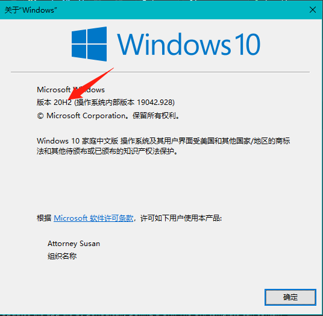
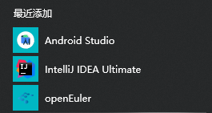
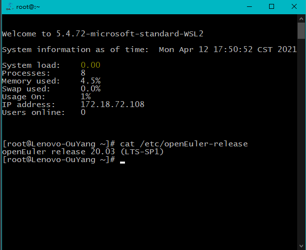
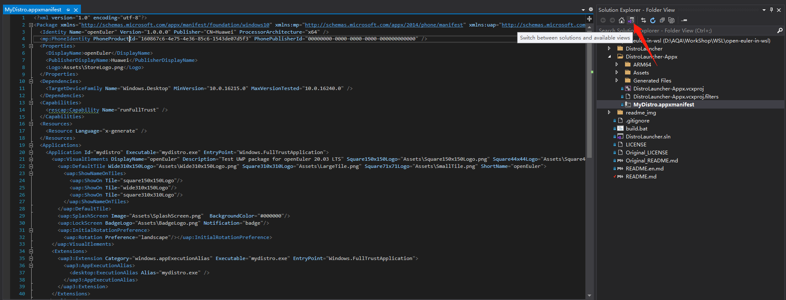

[toc]

*本文档的其他语言:* [English](./README.md), [简体中文](./README.zh-cn.md)

# 如何在WSL运行openEuler

1. 配置Windows环境。
2. 使用我构建好的启动包distro.exe。
3. 或者手动导入openEuler到WSL。

## 配置Windows环境

可以参考[官网文档](https://docs.microsoft.com/en-us/windows/wsl/install-win10)，或者跟着以下文档走。

打开PoweShell，你可以按下Win+Q，搜索PoweShell来打开它。

然后复制粘贴一下命令：

1. 开启WSL服务。

```powershell
dism.exe /online /enable-feature /featurename:Microsoft-Windows-Subsystem-Linux /all /norestart
```

2. 开启虚拟机特性。

```shell
dism.exe /online /enable-feature /featurename:VirtualMachinePlatform /all /norestart
```

3. 下载[64位的Linux内核升级包](https://wslstorestorage.blob.core.windows.net/wslblob/wsl_update_x64.msi)，双击点击运行，可能需要管理员权限。
4. 将WSL2设为默认启动版本。

```shell
wsl --set-default-version 2
```

5. 打开[Microsoft Store](https://aka.ms/wslstore)，并选择您最喜欢的Linux发行版，单击get

   当你第一次启动一个新安装的Linux发行版时，控制台窗口会打开，你会被要求等待一到两分钟来解压文件并存储到你的PC上。未来所有的启动都需要不到一秒的时间。

如果上述有任何问题，可以参考[官网文档](https://docs.microsoft.com/en-us/windows/wsl/install-win10)解决。

请注意，如果你没有升级Windows到20H2版本，开启WSL后会与VMware冲突，二者只能存在一个。

如果你升级了，会解决这个问题。

按下win+R，输入winver，回车，可以看到当前windows版本。



## 使用我构建好的启动包

由于该UWP还没有上传到微软商店，因此暂时只能下载我构建好的安装包：

计划未来将安装包推送到微软应用商城。

1. [下载Appx.zip。](https://github.com/apple-ouyang/WSL-DistroLauncher/releases)

2. 解压缩。

4. 双击mydistro.exe安装openEuler。


当弹出的命令窗口完成后，即安装完毕，即可运行openEuler：

1. 在左下角Windows开始菜单中启动openEuler。




2. 或者命令行运行：

```shell
wsl -d openEuler
```

如果出现类似以下截图内容，则表示成功。




## 手动导入openEuler

[参考官方文档](https://docs.microsoft.com/en-us/windows/wsl/use-custom-distro)

1. 你需要获得一个根文件系统，包含openEuler的所有二进制文件。
   1. 使用docker导出容器文件系统。
   2. 或者使用debootstrap制作根文件系统（还未尝试）。
2. 使用WSL命令导入根文件系统。

### 使用docker导出容器文件系统

[参考文档](https://docs.microsoft.com/en-us/windows/wsl/use-custom-distro)：

1. 下载openEuler LTS SP1的docker镜像，[链接](https://repo.openeuler.org/openEuler-20.03-LTS-SP1/docker_img/x86_64/openEuler-docker.x86_64.tar.xz)。

2. 打开控制台，**进入刚刚下载镜像的文件夹**，启动Ubuntu，此时工作目录任然在当前目录。

```shell
cd D:\Download
wsl -d Ubuntu
```

3. 安装Ubuntu下的docker。

```shell
curl -sSL https://get.daocloud.io/docker | sh
```

4. 导入镜像，-i表示使用tar包来导入镜像。

```shell
docker load -i .\openEuler-docker.x86_64.tar.xz
```

5. 查看现有images。

```shell
docker images
```

应该会有以下输出：

```shell
REPOSITORY                 TAG       IMAGE ID       CREATED         SIZE
openeuler-20.03-lts-sp1    latest    6934cec25f28   3 months ago    512MB
```

6. 随便运行一个命令，加载容器。

```sh
docker run openeuler-20.03-lts-sp1 echo hello, openEuler WSL
```

7. 导出docker容器的快照，即当前文件系统。

docker ps -ql表示获得最近运行的容器的编号，即刚才openEuler的容器编号。

```shell
docker export $(docker ps -ql) > ./openEuler.tar
exit
```

### 使用WSL命令导入根文件系统

退出Ubuntu，在控制台使用WSL命令，导入openEuler包，并指明openEuler的安装目录。

举例，设置D:\work\WSL\openEuler为WSL的安装目录。

```shell
wsl --import openEuler D:\work\WSL\openEuler .\openEuler.tar
```

9. 即可启动openEuler。

```shell
wsl -d openEuler
```


# 构建启动包过程

**如果你只想运行openEuler，那么可以到此为止了。**

如果你对该构建过程感兴趣，你可以接着往下看。

## 构建myditro.exe的大概过程

1. 克隆，修改启动器基本信息。
2. 安装WSL、Ubuntu。
3. 导出根文件系统。
4. 构建包。

## 克隆，修改基本信息

克隆官方启动器仓库。

```shell
git clone https://github.com/Microsoft/WSL-DistroLauncher
```

安装Visual Studio，选择安装“通用Windows平台开发”工具。

使用Visual Studio打开WSL-DistroLauncher工程下的**DistroLauncher.sln。**

双击打开MyDistro.appxmanifest，此时VS会自动探测xml格式，并出现很好看的修改界面如下。


如果您没有在解决方案选项卡中打开MyDistro.appxmanifest，VS将会展现给您全文本的界面。请点击下面的切换按钮，然后双击点击DistroLauncher.sln。



点击Packaging选项卡，点击Choose Certificate...，点击Create...，这里输入Publish Name，我输入了Huawei，本来想用全称HUAWEI TECHNOLOGIES CO., LTD，但是会报错，就用了Huawei。然后输入密码，即可创建证书。

修改Application选项卡下的基本信息，修改Visual Asserts图片信息。

不同大小图片可以使用Asserts Generator，给定一个图片，可以生成不同大小的图片。

官网的logo太小，我找到了部门里的logo矢量图.ai文件，放大了些，并参考Ubuntu启动图标，裁剪了文字部分，只保留了logo，尽量让产生的logo在启动界面好看一些。

最后生成的所有图片可以看我的工程文件。

## 安装WSL、Ubuntu

[参考配置环境这一节](# 配置Windows环境)

## 导出根文件系统

[参考手动导入一节](# 手动导入openEuler)

最后一步改为：

```shell
docker export $(docker ps -ql) > ./install.tar
```

退出Ubuntu，压缩刚才的包。

```shell
exit
gzip.exe -k .\install.tar
```

-k表示保留包，不删除。

## 构建包

将install.tar.gz复制到项目的根目录下。

使用Visual Studio打开WSL-DistroLauncher工程下的DistroLauncher.sln。

在右侧的Solution Explorer，可以看到以下界面。


右键点击"Solution (DistroLauncher)"，在弹出菜单中点击Deploy Solution。

等待编译完成后，则构建完成。

可以在.\x64\Debug\DistroLauncher-Appx\AppX文件夹下看到myditro.exe文件。

打包该APPX文件夹即可发布。